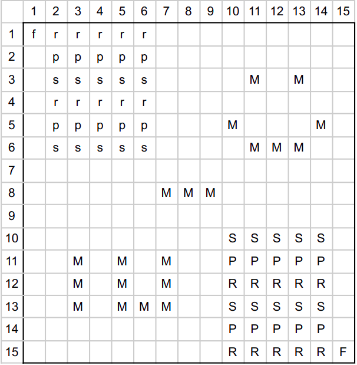

# CLI RPS multiplayer game

Date of completion: 6 May 2021

This is a 2 player game where each player has a set of characters (Rock, Paper, Scissors) and can use them to attack the second player and steal his flag to win. There are obstacles in the game so the players should choose a strategy in a way that does not hit the obstacles and lose, and defend their flag from the enemy.

Initial setup:

This project is coursework for the Introduction to Programming course at Innopolis University. While I realize it is not a good practice to write the whole code in a single file, this was required by the professer to facilitate grading. [see the description](problem_description.pdf).

# Value:

Used smart pointers and templates, documented the code well, and followed the OOP principles.
